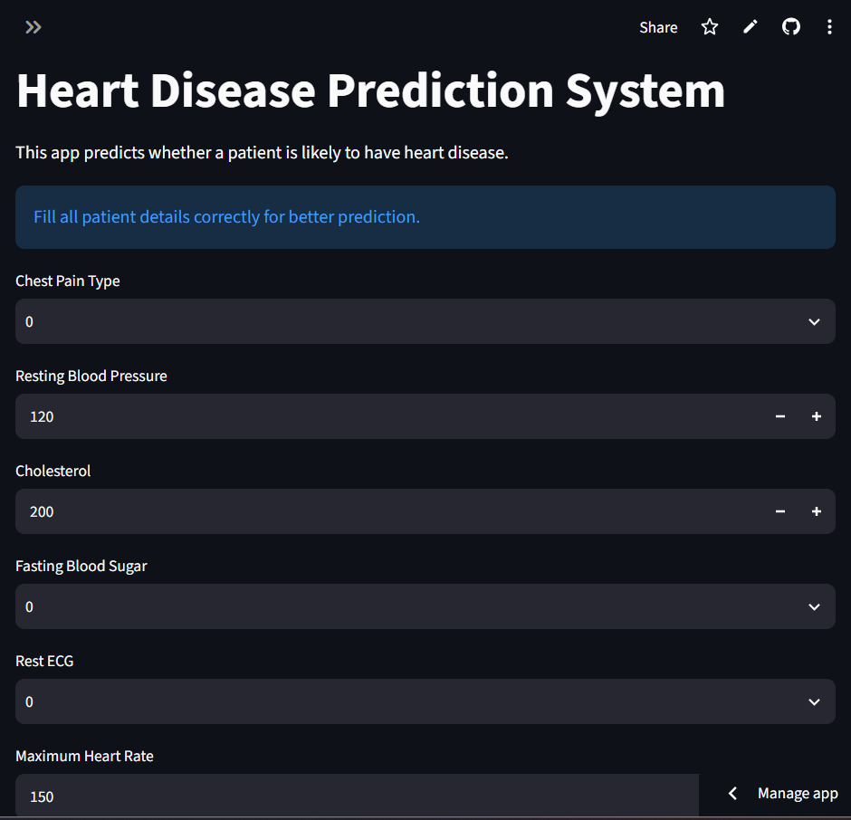

# ❤️ Heart Disease Prediction System

## 📌 Project Overview

This project predicts whether a patient is likely to have heart disease using Machine Learning.

The application is built with Streamlit and uses a Random Forest Classifier trained on the UCI Heart Disease Dataset.

---

## 🚀 Features

- Heart Disease Prediction
- Interactive Streamlit Web Application
- Random Forest Machine Learning Model
- User Friendly Interface
- Prediction Confidence
- Real-time Patient Input

---

## 🛠️ Technologies Used

- Python
- Pandas
- NumPy
- Matplotlib
- Seaborn
- Scikit-learn
- Streamlit
- Joblib

---

## 📊 Dataset

Heart Disease Dataset (UCI Repository)

Dataset Features:

- Age
- Sex
- Chest Pain Type
- Resting Blood Pressure
- Cholesterol
- Fasting Blood Sugar
- Rest ECG
- Maximum Heart Rate
- Exercise Induced Angina
- Old Peak
- Slope
- Number of Major Vessels (CA)
- Thal

Target:

- 0 → No Heart Disease
- 1 → Heart Disease

---

## 🤖 Machine Learning Model

Model Used:

- Random Forest Classifier

Model Evaluation:

- Accuracy
- Confusion Matrix
- Classification Report

---

## 📈 Exploratory Data Analysis (EDA)

Performed using:

- Pandas
- Matplotlib
- Seaborn

EDA Included:

- Dataset Information
- Missing Values Check
- Duplicate Values Check
- Correlation Heatmap
- Distribution Plots
- Count Plots

---

## 📦 Installation

Clone the repository

```bash
git clone https://github.com/sumitkumar0387/Heart-Disease-Prediction.git
```

Go to project folder

```bash
cd Heart-Disease-Prediction
```

Install requirements

```bash
pip install -r requirements.txt
```

Run application

```bash
streamlit run app.py
```

---
## 📷 Application Preview


---

## 📁 Project Structure

```

Heart_Disease_Prediction/

│── app.py
│── heart.csv
│── heart_disease_model.pkl
│── requirements.txt
│── README.md
│── eda.ipynb
│── .gitignore
```
---

## 🌐 Live Demo

https://heart-disease-prediction-yzi48t6yaxwrygc3sbqn4e.streamlit.app/

---
---

## 👨‍💻 Developer

**Sumit Kumar**

Machine Learning Project using Python and Streamlit.
